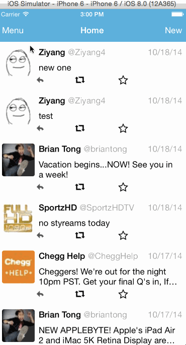

Twitter-Swift
=============
# Twitter Demo

This is an iOS Swift demo application for displaying the Twitter home line and new tweet composition using the [Twitter API](https://dev.twitter.com/overview/documentation).

Time spent: 12 hours spent in total

Completed user stories:

 * [x] Required: Dragging anywhere in the view should reveal the menu.
 * [x] Required: The menu should include links to your profile, the home timeline, and the mentions view.
 * [x] Required: Contains the user header view
 * [x] Required: Contains a section with the users basic stats: # tweets, # following, # followers
 * [x] Required: Tapping on a user image should bring up that user's profile page
 * [x] Optional: Pulling down the profile page should blur and resize the header image.

GIF created with [LiceCap](http://www.cockos.com/licecap/).

